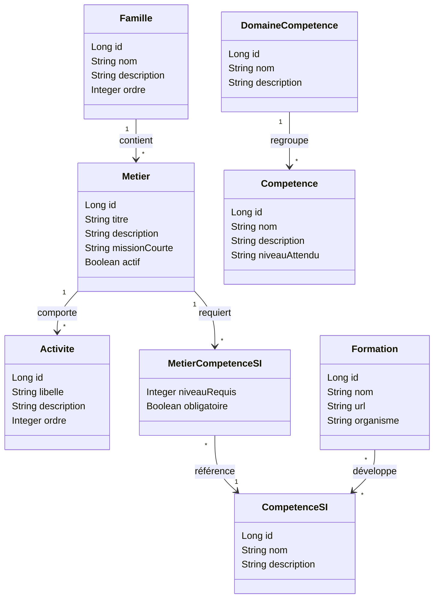

# Projet Tuteuré RH – ASINHPA
### Développement d'une application web de gestion des compétences, du recrutement et des plans de formation pour les DRH du secteur de la santé numérique

> **FIE 4 – Promotion 2027** | Abdallah Hamrouni · Nabilou Anoir  
> Tuteur pédagogique : M. Elyes Lamine | Client : **ASINHPA** | Référentes : Elodie Pospieszynski · Marion Piel

---

## Table des matières

1. [Présentation du projet](#1-présentation-du-projet)
2. [Conception de la solution](#2-conception-de-la-solution)
3. [Développement de l'application](#3-développement-de-lapplication)
4. [Organisation et gestion du projet](#4-organisation-et-gestion-du-projet)
5. [Lancement rapide](#5-lancement-rapide)
6. [Outils de développement](#6-outils-de-développement)
7. [Build de production](#7-build-de-production)

---

## 1. Présentation du projet

### 1.1 Contexte

Ce projet tuteuré de 4ème année, porté par l'**ASINHPA** (fédération d'intérêt général pour une transformation éthique et souveraine du numérique en santé), vise à concevoir et développer une **application web d'aide à la gestion des compétences** à destination des DRH des structures membres.

Une première cartographie des compétences en numérique en santé avait été réalisée avec l'Agence du Numérique en Santé (ANS), mais elle est devenue partiellement obsolète face à l'essor de l'intelligence artificielle, de nouveaux métiers et de nouveaux enjeux de cybersécurité et de souveraineté numérique.

### 1.2 Problématique

Les DRH des structures membres expriment des besoins croissants :
- Identifier les **compétences clés** du numérique en santé
- Anticiper les **tensions de recrutement**
- Définir des **plans de formation** adaptés
- Valoriser les **certifications** et référentiels les plus pertinents

### 1.3 Solution proposée

La solution repose sur trois piliers :
- Un **questionnaire numérisé** (LimeSurvey) pour collecter les besoins terrain des DRH
- Un **référentiel de compétences modulable**, basé notamment sur la nomenclature **Cigref 2022** (50 profils, 9 familles métiers)
- Une **application web** de visualisation et d'analyse des données, offrant des tableaux de bord filtrables par organisation, domaine, horizon temporel ou type de profil

---

## 2. Conception de la solution

### 2.1 Exigences fonctionnelles

| Fonctionnalité | Description |
|---|---|
| Référentiel métiers | Consultation des familles, métiers, activités et compétences SI (Cigref 2022) |
| Gestion des compétences | CRUD complet sur les compétences et domaines, niveau attendu |
| Gestion des formations | Catalogue de formations liées aux compétences, avec liens URL et organisme |
| Comparateur de métiers | Comparaison côte à côte des profils et compétences requises |
| Matching CV | Analyse et classement automatique de CV par rapport au référentiel |
| Tableau de bord | Vue synthétique des indicateurs RH |
| Authentification | Système de sécurité via Firebase Authentication |

### 2.2 Diagramme des cas d'utilisation (synthèse)

Les acteurs principaux sont :
- **DRH / Utilisateur** : consulte le référentiel, filtre les métiers, compare des profils, accède aux formations
- **Administrateur** : gère le référentiel (CRUD familles, métiers, compétences, formations)
- **Système IA (Ollama)** : classe automatiquement les CV soumis

### 2.3 Modèle conceptuel de données



### 2.4 Architecture logicielle

L'architecture suit un pattern **client-serveur découplé** (frontend SPA ↔ API REST backend) :

```
┌─────────────────────────────────────────────────────┐
│                    FRONTEND (React)                  │
│  Dashboard │ Référentiel │ CV Matcher │ Formations  │
│                   React Router v6                    │
│          Axios (appels API REST) + Recharts          │
└────────────────────┬────────────────────────────────┘
                     │ HTTP / JSON
┌────────────────────▼────────────────────────────────┐
│                BACKEND (Spring Boot 3)               │
│   /api/metiers │ /api/familles │ /api/competences    │
│   /api/formations │ /api/referentiel │ /ollama       │
│         Spring Security + Firebase Auth Filter       │
└────────┬──────────────────────────┬─────────────────┘
         │ JPA / Hibernate          │ REST
┌────────▼──────┐          ┌────────▼─────────────────┐
│ H2 (dev)      │          │ Ollama (Mistral) – IA CV  │
│ PostgreSQL     │          └──────────────────────────┘
│ (production)  │
└───────────────┘
```

### 2.5 Interfaces utilisateur (pages principales)

| Route | Page | Description |
|---|---|---|
| `/` | Dashboard | Vue synthétique, KPIs et statistiques globales |
| `/referentiel` | Familles Métiers | Liste des 9 familles Cigref avec navigation |
| `/referentiel/famille/:id` | Détail Famille | Métiers rattachés, filtres, accès rapide |
| `/referentiel/metier/:id` | Détail Métier | Activités, compétences requises, niveaux |
| `/referentiel/competences` | Compétences SI | Catalogue complet, filtres par domaine |
| `/referentiel/formations` | Formations | Catalogue de formations, lien compétences |
| `/referentiel/comparateur` | Comparateur | Comparaison côte à côte de plusieurs métiers |
| `/cv-matcher` | CV Matcher | Upload CV, matching IA avec le référentiel |

---

## 3. Développement de l'application

### 3.1 Technologies et outils utilisés

#### 3.1.1 Backend

| Technologie | Version | Rôle |
|---|---|---|
| **Java** | 21 | Langage principal |
| **Spring Boot** | 3.x | Framework applicatif |
| **Spring Data JPA** | — | ORM / persistance |
| **Spring Security** | — | Sécurisation des endpoints |
| **Spring Data REST** | — | Exposition automatique des repositories |
| **Springdoc OpenAPI** | 2.0.2 | Documentation Swagger UI |
| **Lombok** | 1.18.34 | Réduction du boilerplate Java |
| **ModelMapper** | 3.2.0 | Mapping entités ↔ DTO |
| **Firebase Admin SDK** | 9.2.0 | Vérification des tokens d'authentification |

#### 3.1.2 Frontend

| Technologie | Version | Rôle |
|---|---|---|
| **React** | 18.3.x | Framework UI |
| **TypeScript** | 5.7.x | Typage statique |
| **Vite** | 6.x | Build tool et dev server |
| **Tailwind CSS** | 3.4.x | Styles utilitaires |
| **React Router DOM** | 6.28.x | Routing SPA |
| **Axios** | 1.14.x | Client HTTP |
| **Recharts** | 3.8.x | Visualisation de données |
| **Firebase** | 12.x | Authentification côté client |
| **PapaParse** | 5.4.x | Parsing CSV |
| **PDF.js** | 5.4.x | Lecture de fichiers PDF (CV) |

#### 3.1.3 Base de données

- **H2** (en mémoire) : environnement de développement local — accessible via console web
- **PostgreSQL** : environnement de production/staging

#### 3.1.4 Sécurité

L'authentification repose sur **Firebase Authentication** :
- Le frontend obtient un **JWT Firebase** lors de la connexion
- Chaque requête API l'envoie dans le header `Authorization: Bearer <token>`
- Le backend vérifie le token via `FirebaseAuthenticationFilter` avant d'autoriser l'accès

#### 3.1.5 Intelligence Artificielle

- **Ollama + Mistral** : serveur IA local utilisé pour le classement automatique des CV
- Le contrôleur `OllamaController` expose un endpoint dédié au matching CV/référentiel

### 3.2 Structure du projet

```
Projet-tutore-RH/                    ← Monorepo Maven
├── backend/                         ← Module Spring Boot
│   └── src/main/java/isis/projet/backend/
│       ├── BackendApplication.java
│       ├── config/                  ← Configuration CORS, Firebase, etc.
│       ├── controller/              ← OllamaController (IA)
│       ├── security/                ← FirebaseAuthenticationFilter, SecurityConfig
│       ├── metiers/                 ← Module Métiers SI (Cigref)
│       │   ├── entity/              ← Famille, Metier, Activite, CompetenceSI,
│       │   │                           Formation, MetierCompetenceSI
│       │   ├── controller/
│       │   ├── service/
│       │   ├── repository/
│       │   └── dto/
│       └── referentiel/             ← Module Référentiel (compétences génériques)
│           ├── entity/              ← Competence, DomaineCompetence
│           ├── controller/
│           ├── service/
│           └── repository/
├── frontend/                        ← Module React + TypeScript
│   └── src/
│       ├── App.tsx                  ← Routage principal
│       ├── pages/                   ← DashboardPage, FamillesListPage,
│       │                               MetierDetailPage, CompetencesSIPage,
│       │                               FormationsPage, MetiersComparisonPage, CvMatcherPage
│       ├── components/              ← Navbar, MappingPanel, Referentiel/, CvMatcher/
│       ├── contexts/                ← AuthContext, SurveyContext, CvMatcherContext
│       ├── api/                     ← cvApi.ts (appels backend)
│       ├── types/                   ← Interfaces TypeScript
│       └── utils/
├── .gitlab-ci.yml                   ← Pipeline CI/CD (build + push Docker)
├── Dockerfile.backend
├── Dockerfile.frontend
├── docker-compose.yml
└── pom.xml                          ← POM parent (monorepo)
```

### 3.3 Gestion de versions et DevOps

#### Versioning Git
- Dépôt Git avec branches de fonctionnalités
- Organisation en monorepo : frontend et backend dans le même dépôt

#### Intégration Continue (GitLab CI)

Le pipeline `.gitlab-ci.yml` comporte deux stages :

```
build  →  build_frontend (Node 20, npm ci + npm run build)
       ↓
package → package_frontend (Docker build + push registry GitLab)
        → package_backend  (Docker build + push registry GitLab)
```

#### Conteneurisation

| Fichier | Description |
|---|---|
| `Dockerfile.backend` | Image Spring Boot JAR Java 21 |
| `Dockerfile.frontend` | Image Nginx servant le build Vite |
| `docker-compose.yml` | Orchestration locale (backend + frontend) |

---

## 4. Organisation et gestion du projet

### 4.1 Équipe et répartition des rôles

| Membre | Rôle principal |
|---|---|
| Abdallah Hamrouni | Chef de projet |
| Nabilou Anoir | Développement (fullstack) |

> ⚠️ L'équipe passe de 4 à **2 membres** en second semestre, ce qui impose une documentation rigoureuse et un transfert de connaissances anticipé.

### 4.2 Parties prenantes

| Partie prenante | Rôle |
|---|---|
| M. Elyes Lamine (ISIS) | Tuteur pédagogique, conseiller technique |
| ASINHPA | Client / Maître d'ouvrage |
| Elodie Pospieszynski | Référente client |
| Marion Piel | Référente client |

### 4.3 Principaux risques identifiés

| Risque | Mitigation |
|---|---|
| Faible taux de réponses au questionnaire | Relances ciblées avec l'aide du tuteur et de l'ASINHPA |
| Réduction de l'équipe au S2 | Documentation continue, transfert de connaissances |
| Complexité technique de l'architecture | Architecture progressive, choix technologiques éprouvés |
| Conformité RGPD | L'outil ne collecte pas de données personnelles nominatives |
| Décalage attentes/périmètre réalisable | Réunions de cadrage régulières avec le client |

### 4.4 Planning prévisionnel (Gantt synthétique)

| Phase | Semestre 1 | Semestre 2 |
|---|---|---|
| Analyse des besoins & état de l'art | ✅ | — |
| Conception questionnaire (LimeSurvey) | ✅ | — |
| Architecture fonctionnelle et technique | ✅ | — |
| Développement prototype (backend + frontend) | — | 🔄 |
| Exploitation des données questionnaire | — | 🔄 |
| Tests, documentation, livraison finale | — | 🔄 |

---

## 5. Lancement rapide

### Prérequis
- **JDK 21**
- **Node.js 18+**
- **Maven** (ou le wrapper `./mvnw` fourni)
- *(Optionnel)* **Ollama** avec le modèle `mistral` pour le matching IA

### Démarrer le backend
```bash
# Depuis la racine du projet
./mvnw --projects backend spring-boot:run
```
> L'API est disponible sur **http://localhost:8989**

### Démarrer le frontend
```bash
cd frontend
npm install
npm run dev
```
> L'interface est disponible sur **http://localhost:5173**

### Configuration Firebase
Le frontend lit ses identifiants Firebase depuis `frontend/.env`.  
Copiez `frontend/.env.example` → `frontend/.env` et renseignez vos valeurs si vous utilisez votre propre projet Firebase.

---

## 6. Outils de développement

### Swagger UI (documentation API)
Testez tous les endpoints REST directement depuis le navigateur :
- **URL** : [http://localhost:8989/swagger-ui/index.html](http://localhost:8989/swagger-ui/index.html)

### Console H2 (base de données en mémoire)
Visualisez et manipulez les données en développement :
- **URL** : [http://localhost:8989/h2-console](http://localhost:8989/h2-console)
- **JDBC URL** : `jdbc:h2:mem:testdb`
- **User** : `sa` | **Password** : *(vide)*

> Connexion client externe (IntelliJ, DBeaver) : `jdbc:h2:tcp://localhost:9092/mem:testdb`

### Intelligence Artificielle – Ollama
```bash
ollama serve   # Lance le serveur IA local (modèle mistral)
```
L'application classera automatiquement les CV uploadés en fonction du référentiel métier actif.

---

## 7. Build de production

Pour générer un JAR unique embarquant le backend et le frontend compilé :

```bash
# 1. Build du frontend
cd frontend && npm run build

# 2. Packaging Maven (copie le dist dans backend/src/main/resources/public)
cd .. && ./mvnw clean install
```

Le JAR final est disponible dans : `backend/target/backend-0.0.1-SNAPSHOT.jar`

```bash
java -jar backend/target/backend-0.0.1-SNAPSHOT.jar
```

---

## Bibliographie sélective

- Cigref (2022). *Nomenclature des profils métiers du SI* — base du référentiel intégré
- ANAP (2020). *Référentiel de compétences SI en structure sanitaire et médico-sociale*
- CEN (2014). *European e-Competence Framework 3.0*
- Dietrich et al. (2010). *Management des compétences*, Dunod
- Barabel et al. (2017). *Innovations RH – Le SIRH*, Dunod

---

*Rapport d'avancement – Décembre 2025 | École d'Ingénieurs ISIS – FIE 4 Promotion 2027*
