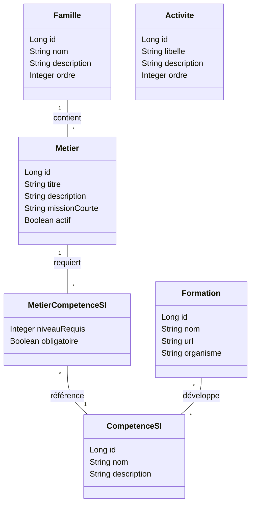

# Projet Tutoré RH - Gestion du Référentiel Métiers SI

Ce projet est une application de gestion des ressources humaines concentrée sur le référentiel des métiers du Système d'Information (SI), basé sur la nomenclature **Cigref 2022**.

## 🏗️ Structure du Projet

Le projet est un monorepo contenant :
- **`/backend`** : API Spring Boot 3, JPA, H2, Swagger.
- **`/frontend`** : Interface React moderne avec Vite, TypeScript et CSS de pointe (Design Premium).

---

## 🌟 Nouvelles Fonctionnalités

### 1. Gestion des Formations
- **Plateforme de Formations** : Une nouvelle section `/referentiel/formations` permet de gérer un catalogue de formations.
- **Lien Compétences ↔ Formations** : Chaque compétence SI peut être liée à une ou plusieurs formations.
- **Accès Rapide** : Popups interactifs pour consulter les formations liées à une compétence.

### 2. Tri Hiérarchique Intelligent
- **Classement par Niveau** : Les compétences d'un métier sont triées par importance : **Expert (5/4) > Avancé (3) > Intermédiaire (2) > Notions (1)**.

---

## 🚀 Lancement Rapide

### 1. Prérequis
- **JDK 21** (impératif pour la compilation).
- **Node.js 18+**.
- **Maven** (utilisez le wrapper `./mvnw` fourni).

### 2. Démarrer le Backend
Depuis la racine du projet :
```bash
./mvnw --projects backend spring-boot:run
```
*L'application est configurée sur le port **8989**.*

### 3. Démarrer le Frontend
Dans un autre terminal :
```bash
cd frontend
npm install
npm run dev
```
*L'interface est disponible sur [http://localhost:5173](http://localhost:5173).*

---

## 📊 Modèle de Données (Référentiel)

Voici le diagramme de classe simplifié de la gestion du référentiel métiers :



---

## 🛠️ Outils de Développement

### 🔍 Swagger UI (Exploration API)
L'API est documentée via Swagger. Vous pouvez tester tous les endpoints (GET, POST, etc.) directement depuis votre navigateur.
- **URL** : [http://localhost:8989/swagger-ui/index.html](http://localhost:8989/swagger-ui/index.html)

### 🗄️ Console H2 (Base de données)
Le projet utilise une base de données H2 en mémoire. Pour visualiser ou manipuler les données manuellement :
- **URL** : [http://localhost:8989/h2-console](http://localhost:8989/h2-console)
- **JDBC URL** : `jdbc:h2:mem:testdb`
- **User** : `sa`
- **Password** : *(laisser vide)*

> **Note** : Vous pouvez également vous connecter via un client externe (IntelliJ, DBeaver) en utilisant : `jdbc:h2:tcp://localhost:9092/mem:testdb`.

---

## 🤖 Intelligence Artificielle (Ollama)

Si vous avez **Ollama** installé localement avec le modèle `mistral` :
1. Lancez Ollama : `ollama serve`.
2. L'application pourra classer automatiquement les CV en fonction du référentiel métier chargé.

---

## 📦 Build de Production

Pour générer un seul fichier JAR contenant le backend et le frontend :
```bash
# Dans frontend
npm run build
# À la racine
./mvnw clean install
```
Le JAR généré se trouvera dans `backend/target/backend-0.0.1-SNAPSHOT.jar`.
